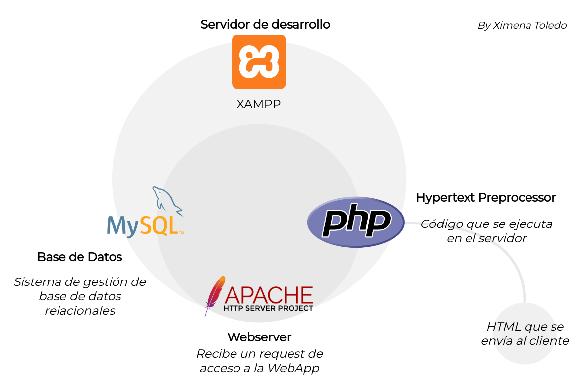

## PROYECTO CRUD 
Elaborado por Ximena Toledo

## ARQUITECTURA


## REQUISITOS
1. Tener instalado Apache
2. Tener instalado PHP
3. Tener instalado Mysql

## COMANDOS 
---

### 1. Instalando XAMPP


Cambiando los permisos del instalador

```bash
chmod 755 xampp-linux-*-installer.run
```

Ejecutar el instalador

```bash
sudo ./xampp-linux-*-installer.run
```

### 2. Permisos de carpetas

```bash
sudo chown -R usuario:grupo /opt/lampp/htdocs
```

Alternativa
```bash
sudo chown 2775 /opt/lampp/htdocs
```
### 3. Iniciar XAMPP

```bash
sudo /opt/lampp/lampp start
```

Detener XAMPP
```bash
sudo /opt/lampp/lampp stop
```
